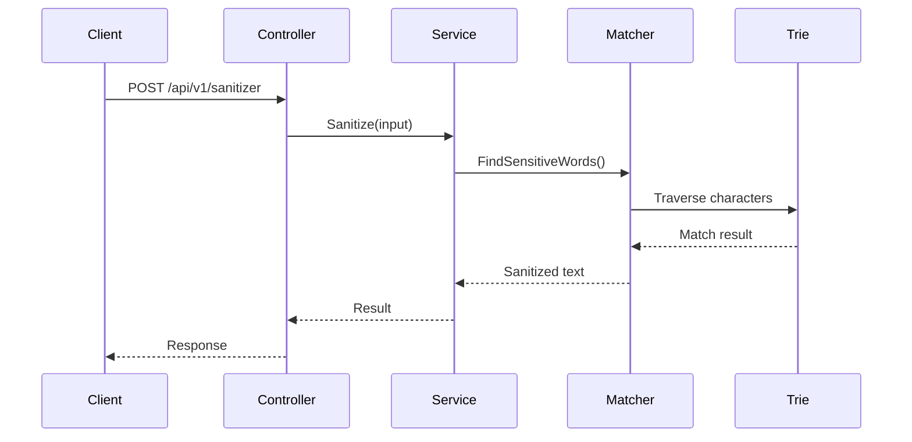

# Sensitive Words Service

A high-performance ASP.NET Core Web API for detecting and sanitizing sensitive words using a Trie-based matching algorithm.

**Author:** Ndiphiwe Nombula  
**Role:** Senior Software Developer (C#) Assessment


---

## ✨ Overview
A high-performance ASP.NET Core Web API for detecting and sanitizing sensitive words using an in-memory Trie-based pattern matching algorithm.

## 🧰 Tech Stack

<p>
  
  
  
  
  
</p>

**Core Technologies**

- ASP.NET Core (.NET 9)
- C#
- SQL Server
- Dapper
- FluentValidation
- Swagger / OpenAPI
- GitHub Actions (CI/CD)

## 🚀 Features
- Trie-based sensitive word detection
- High-performance in-memory text scanning
- RESTful ASP.NET Core API
- Clean Architecture implementation
- SQL Server stored procedures
- Automated testing with xUnit
- CI pipeline with GitHub Actions

## 🏗 Architecture
The project follows **Clean Architecture principles** separating API, Application, Domain, and Infrastructure layers.


---

## Preview

### Swagger API Documentation

<p align="center">
  
</p>

The API provides endpoints for managing sensitive words and sanitizing user input using a high-performance Trie-based matching algorithm.

### Key Endpoints

| Method | Endpoint | Description |
|------|---------|-------------|
| GET | /api/v1/sensitive-words | Retrieve all sensitive words |
| POST | /api/v1/sensitive-words | Add a new sensitive word |
| PUT | /api/v1/sensitive-words/{id} | Update an existing sensitive word |
| DELETE | /api/v1/sensitive-words/{id} | Delete a sensitive word |
| POST | /api/v1/sanitizer | Sanitize input text |

---

## Project Status

This project was developed as part of a **Senior Backend Developer technical assessment** and demonstrates:

- Clean Architecture principles
- High-performance text processing using a Trie data structure
- RESTful API design
- Automated testing and CI pipeline integration
- Production-ready engineering practices

---

## Table of Contents

- [Overview](#overview)
- [Key Features](#key-features)
- [Quick Start](#quick-start)
- [API Example](#api-example)
- [Architecture Summary](#architecture-summary)
- [System Architecture Diagram](#system-architecture-diagram)
- [Request Processing Flow](#request-processing-flow)
- [Project Structure](#project-structure)
- [Database Setup](#database-setup)
- [Technology Stack](#technology-stack)
- [Documentation](#documentation)
- [Production Considerations](#production-considerations)
- [Author](#author)

---


# Key Features

- Trie-based sensitive word detection
- High-performance text sanitization
- RESTful ASP.NET Core Web API
- Clean Architecture implementation
- SQL Server stored procedures
- FluentValidation request validation
- Global exception handling using ProblemDetails
- Correlation ID request tracing
- Structured logging
- Swagger API documentation
- Health check endpoints
- Unit and integration testing

---

# Quick Start

## 1 Clone the Repository

```bash
git clone https://github.com/Ndipza/SensitiveWordsService.git
cd SensitiveWordsService
```

## 2 Run the API

```bash
dotnet run --project src/SensitiveWords.Api
```

## 3 Open Swagger

```
https://localhost:7228/swagger
```

## 4 Run Tests

```bash
dotnet test
```

---

# API Example

### Request

```
POST /api/v1/sanitizer
```

```json
{
  "input": "SELECT * FROM USERS"
}
```

### Response

```json
{
  "output": "****** * **** USERS"
}
```

---

# Architecture Summary

```
Client
  ↓
API Controllers
  ↓
Application Services
  ↓
Domain Algorithms (Trie + Matcher)
  ↓
Infrastructure Repositories
  ↓
SQL Server
```

The project follows **Clean Architecture principles**, ensuring clear separation of responsibilities.

| Layer | Responsibility |
|------|----------------|
| API | Controllers, middleware, filters |
| Application | Business logic and services |
| Domain | Core models and algorithms |
| Infrastructure | Database access and repositories |

---

# System Architecture Diagram


```
                  +-------------------+
                  |       Client      |
                  |  Web / Mobile     |
                  +---------+---------+
                            |
                            v
                  +-------------------+
                  |  ASP.NET Core API |
                  |     Controllers   |
                  +---------+---------+
                            |
                            v
                  +-------------------+
                  |  Application Layer|
                  |  Services         |
                  +---------+---------+
                            |
                            v
                  +-------------------+
                  |  Domain Layer     |
                  |  Trie + Matcher   |
                  +---------+---------+
                            |
                            v
                  +-------------------+
                  | Infrastructure    |
                  | Repositories      |
                  +---------+---------+
                            |
                            v
                  +-------------------+
                  |     SQL Server    |
                  |   SensitiveWords  |
                  +-------------------+
```

### Flow Description

1. The **Client** sends a request to the API.
2. The **Controller** receives and validates the request.
3. The request is passed to **Application Services**.
4. The **SensitiveWordMatcher** scans the text using the **Trie structure**.
5. Sensitive words are masked in memory.
6. The sanitized response is returned to the client.


---

# Request Processing Flow

```
Client
  ↓
SanitizerController
  ↓
SanitizationService
  ↓
SensitiveWordMatcher
  ↓
Trie
  ↓
Sanitized Response
```

Sensitive words are loaded into a Trie during application startup, enabling **extremely fast in-memory pattern matching**.

### Request Flow



---

# Project Structure

```
src
 ├ SensitiveWords.Api
 ├ SensitiveWords.Application
 ├ SensitiveWords.Domain
 └ SensitiveWords.Infrastructure

tests
 └ SensitiveWords.Tests

database
 ├ init.sql
 ├ stored_procedures.sql
 └ seed_sensitive_words.sql

docs
 ├ API_EXAMPLES.md
 ├ DESIGN_RATIONALE.md
 ├ ARCHITECTURE_DIAGRAMS.md
 ├ PROJECT_STRUCTURE.md
 ├ RUNNING_THE_PROJECT.md
 └ TESTING.md
```

---

# Database Setup

The application uses **SQL Server** and interacts with the database through **stored procedures using Dapper**.

Database scripts are located in:

```
database/
```

### Setup Steps

1. Run `init.sql` to create tables  
2. Run `stored_procedures.sql` to create stored procedures  
3. Run `seed_sensitive_words.sql` to insert initial sensitive words  

Example connection string:

```json
"ConnectionStrings": {
  "DefaultConnection": "Server=localhost;Database=SensitiveWordsDb;Trusted_Connection=True;TrustServerCertificate=True"
}
```

---

# Technology Stack

### Backend

- ASP.NET Core (.NET 9)
- C#

### Database

- SQL Server
- Stored Procedures

### Libraries

- Dapper
- FluentValidation
- Swashbuckle (Swagger)

### Testing

- xUnit
- Moq
- FluentAssertions
- Coverlet

---

# Project Documentation

This folder contains detailed documentation for the **Sensitive Words Service** project.

## Documentation Index

### Architecture

- [Architecture Diagrams](ARCHITECTURE_DIAGRAMS.md)
- [Design Rationale](DESIGN_RATIONALE.md)

### Project Setup

- [Running the Project](RUNNING_THE_PROJECT.md)
- [Project Structure](PROJECT_STRUCTURE.md)

### Development

- [Testing Strategy](TESTING.md)
- [API Examples](API_EXAMPLES.md)

### Assets

Images used in documentation are located in:

### Coverage Badge


---

# Production Considerations

Although this project was created for a technical assessment, it was designed with **production-ready principles**.

### Scalability

The API is **stateless**, allowing horizontal scaling across multiple instances.

Possible improvements:

- Redis distributed caching
- Background refresh of sensitive words
- Kubernetes deployment

---

### Security

Security practices implemented:

- Parameterized stored procedures
- Input validation using FluentValidation
- Centralized error handling
- Controlled database access

Possible improvements:

- API authentication and authorization
- Rate limiting
- Web Application Firewall

---

### Observability

The system supports:

- Structured logging
- Correlation ID request tracing
- Health checks

Example endpoints:

```
/health/live
/health/ready
```

Future improvements:

- OpenTelemetry tracing
- Prometheus metrics
- Centralized logging

---

### Reliability

The service ensures reliability by:

- Loading sensitive words during application startup
- Verifying database connectivity with health checks
- Using standardized error responses

---

# Author

**Ndiphiwe Nombula**  
Senior Software Developer (C#)

