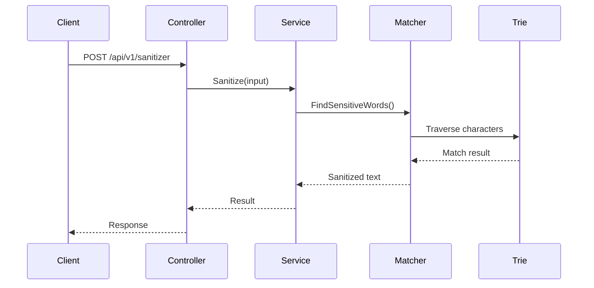

# Sensitive Words Service

A high-performance ASP.NET Core Web API for detecting and sanitizing sensitive words using a Trie-based matching algorithm.

**Author:** Ndiphiwe Nombula  
**Role:** Senior Software Developer (C#) Assessment


---

## ✨ Overview
A high-performance ASP.NET Core Web API for detecting and sanitizing sensitive words using an in-memory Trie-based pattern matching algorithm.

## 🧰 Tech Stack

<p>
  
  
  
  
  
</p>

**Core Technologies**

- ASP.NET Core (.NET 9)
- C#
- SQL Server
- Dapper
- FluentValidation
- Swagger / OpenAPI
- Docker
- GitHub Actions (CI/CD)

## 🚀 Features
- Trie-based sensitive word detection
- High-performance in-memory text scanning
- RESTful ASP.NET Core API
- Clean Architecture implementation
- SQL Server stored procedures
- FluentValidation request validation
- Swagger API documentation
- Global exception handling using ProblemDetails
- Correlation ID request tracing
- Structured logging
- Health check endpoints
- Unit and integration testing
- CI pipeline with GitHub Actions
- Docker containerization

## 🏗 Architecture
The project follows **Clean Architecture principles** separating concerns between:

- API Layer
- Application Layer
- Domain Layer
- Infrastructure Layer


---

## Preview

### Swagger API Documentation

<p align="center">
  
</p>

The API provides endpoints for managing sensitive words and sanitizing user input using a high-performance Trie-based matching algorithm.

### Key Endpoints

| Method | Endpoint | Description |
|------|---------|-------------|
| GET | /api/v1/sensitive-words | Retrieve all sensitive words |
| POST | /api/v1/sensitive-words | Add a new sensitive word |
| PUT | /api/v1/sensitive-words/{id} | Update an existing sensitive word |
| DELETE | /api/v1/sensitive-words/{id} | Delete a sensitive word |
| POST | /api/v1/sanitizer | Sanitize input text |

---

## Project Status

This project was developed as part of a **Senior Backend Developer technical assessment** and demonstrates:

- Clean Architecture design
- High-performance Trie-based algorithms
- Production-ready engineering practices
- CI/CD automation
- Docker containerization
- Comprehensive automated testing

---

## Table of Contents

- Overview
- Features
- Quick Start
- Docker Setup
- API Example
- Architecture Summary
- Request Processing Flow
- Trie Algorithm Performance
- System Design Considerations
- Future Improvements
- Summary
- Project Structure
- Database Setup
- SQL Error Codes
- Stored Procedures
- Technology Stack
- Documentation
- Production Considerations
- Author

---


# Key Features

- Trie-based sensitive word detection
- High-performance text sanitization
- RESTful ASP.NET Core Web API
- Clean Architecture implementation
- SQL Server stored procedures
- FluentValidation request validation
- Global exception handling using ProblemDetails
- Correlation ID request tracing
- Structured logging
- Swagger API documentation
- Health check endpoints
- Unit and integration testing

---

# Quick Start

## 1 Clone the Repository

```bash
git clone https://github.com/Ndipza/SensitiveWordsService.git
cd SensitiveWordsService
```

## 2 Run the API

```bash
dotnet run --project src/SensitiveWords.Api
```

## 3 Open Swagger

```
https://localhost:7228/swagger
```

## 4 Run Tests

```bash
dotnet test
```

---

## 5 Test Coverage

The project uses XPlat Code Coverage and ReportGenerator to generate local coverage reports.

Generate Coverage Report

Run the following command from the solution root:

```bash 
dotnet test --collect:"XPlat Code Coverage" ; reportgenerator -reports:**/coverage.cobertura.xml -targetdir:coverage-report -reporttypes:"Html;TextSummary"
```

Open Coverage Report
start coverage-report/index.html

---

# Docker Setup

## Install Docker
Download Docker Desktop from https://www.docker.com/products/docker-desktop and follow the installation instructions for your operating system.

Verify installation:
```bash
docker --version
docker-compose version
```
## Build and Run with Docker Compose

Build image:
```bash
doker build -t sensitive-words-api .
```

Run Container:
```bash
docker run -d -p 8080:8080 --name sensitive-words-api
```

Open Swagger:
```bash
http://localhost:8080/swagger
```

## Run with Docker Compose
`Start both API and SQL Server using Docker Compose:`
```bash
docker-compose up --build

docker-compose down
``
---

# API Example

### Request

```
POST /api/v1/sanitizer
```

```json
{
  "input": "SELECT * FROM USERS"
}
```

### Response

```json
{
  "output": "****** * **** USERS"
}
```

---

# Architecture Summary

```
Client
  ↓
API Controllers
  ↓
Application Services
  ↓
Domain Algorithms (Trie + Matcher)
  ↓
Infrastructure Repositories
  ↓
SQL Server
```

The project follows **Clean Architecture principles**, ensuring clear separation of responsibilities.

| Layer | Responsibility |
|------|----------------|
| API | Controllers, middleware, filters |
| Application | Business logic and services |
| Domain | Core models and algorithms |
| Infrastructure | Database access and repositories |

---

# System Architecture Diagram


```
                  +-------------------+
                  |       Client      |
                  |  Web / Mobile     |
                  +---------+---------+
                            |
                            v
                  +-------------------+
                  |  ASP.NET Core API |
                  |     Controllers   |
                  +---------+---------+
                            |
                            v
                  +-------------------+
                  |  Application Layer|
                  |  Services         |
                  +---------+---------+
                            |
                            v
                  +-------------------+
                  |  Domain Layer     |
                  |  Trie + Matcher   |
                  +---------+---------+
                            |
                            v
                  +-------------------+
                  | Infrastructure    |
                  | Repositories      |
                  +---------+---------+
                            |
                            v
                  +-------------------+
                  |     SQL Server    |
                  |   SensitiveWords  |
                  +-------------------+
```

### Flow Description

1. The **Client** sends a request to the API.
2. The **Controller** receives and validates the request.
3. The request is passed to **Application Services**.
4. The **SensitiveWordMatcher** scans the text using the **Trie structure**.
5. Sensitive words are masked in memory.
6. The sanitized response is returned to the client.


---

# Request Processing Flow

```
Client
  ↓
SanitizerController
  ↓
SanitizationService
  ↓
SensitiveWordMatcher
  ↓
Trie
  ↓
Sanitized Response
```

Sensitive words are loaded into a Trie during application startup, enabling **extremely fast in-memory pattern matching**.

### Request Flow



---

---

# Trie Algorithm Performance

The sensitive word detection engine uses a **Trie (prefix tree)** data structure to efficiently match multiple patterns within text.

Unlike naive string comparison approaches that repeatedly scan the text for each word, the Trie allows scanning the input **only once**.

## Why Trie?

A Trie is ideal for pattern matching when:

- Multiple keywords must be detected
- Fast lookup is required
- Patterns share common prefixes
- Real-time processing is required

This makes it well suited for:

- Content moderation
- Chat filtering
- Input sanitization
- Security filtering

---

## Complexity Analysis

Let:

N = length of input text
M = number of sensitive words
K = average word length

### Trie Construction

Sensitive words are loaded into the Trie during application startup.

Time Complexity: O(M × K)
Space Complexity: O(M × K)


This operation occurs **once at startup**, not during every request.

---

### Text Sanitization

During request processing, the input text is scanned character-by-character.


Time Complexity: O(N)
Space Complexity: O(1)


Because the Trie traversal happens in memory, the algorithm avoids repeated string comparisons.

---

## Performance Advantages

Compared with naive approaches:

| Approach | Complexity |
|--------|-------------|
Naive word scanning | O(N × M) |
Trie matching | **O(N)** |

This means performance remains **stable even with large dictionaries of sensitive words**.

---

# System Design Considerations

This service was designed with **production-ready system design principles**.

---

## Stateless API

The API is stateless, meaning it does not store session data.

Benefits:

- Horizontal scalability
- Load balancing across instances
- Cloud-native deployment

---

## In-Memory Trie Engine

Sensitive words are loaded into memory during startup:

Database → Trie Engine → In-Memory Matching


Benefits:

- Eliminates repeated database queries
- Extremely fast pattern matching
- Low latency request processing

---

## Request Processing Pipeline

Client
↓
ASP.NET Controller
↓
Application Service
↓
Trie Matcher
↓
Sanitized Response


The API layer handles HTTP concerns while the **Application layer manages business logic**.

---

## Database Interaction

Database access is isolated in the **Infrastructure layer**.

The application interacts with SQL Server through:

- Dapper
- Stored procedures
- Repository pattern

Benefits:

- Clear separation of concerns
- Testability
- Replaceable infrastructure

---

# Future Improvements

Although designed for a technical assessment, the system can be extended for real-world deployments.

### Scalability Improvements

- Redis caching
- Distributed Trie updates
- Kubernetes deployment
- Horizontal API scaling

---

### Security Enhancements

- Authentication and authorization
- API rate limiting
- Request throttling
- Web Application Firewall

---

### Observability

Potential improvements include:

- OpenTelemetry tracing
- Prometheus metrics
- Centralized logging with ELK stack

---

# Summary

This project demonstrates a **production-grade backend service** implementing:

- Clean Architecture
- Trie-based high-performance text filtering
- RESTful API design
- SQL Server integration
- Automated testing
- CI/CD pipeline
- Docker containerization
- Comprehensive documentation

The design emphasizes **performance, maintainability, and scalability**, reflecting best practices expected from a **Senior Software Developer**.

---

# Project Structure

```
SensitiveWordsService
│
├── .github
│   └── workflows
│       └── tests.yml
│
├── database
│   ├── migrations
│   │   └── init.sql
│   │
│   ├── procedures
│   │   └── stored_procedures.sql
│   │
│   └── seeds
│       └── seed_sensitive_words.sql
│
├── docs
│   ├── coverage
│   │   └── badge_linecoverage.svg
│   │
│   └── images
│       ├── architecture-diagram.png
│       └── swagger-preview.png
│
├── src
│   ├── SensitiveWords.Api
│   │
│   │   ├── Configuration
│   │   │   ├── ControllerConfiguration.cs
│   │   │   ├── EndpointConfiguration.cs
│   │   │   ├── HealthChecksConfiguration.cs
│   │   │   ├── MiddlewareConfiguration.cs
│   │   │   ├── RateLimitingConfiguration.cs
│   │   │   ├── SwaggerConfiguration.cs
│   │   │   ├── ValidationConfiguration.cs
│   │   │   └── VersioningConfiguration.cs
│   │
│   │   ├── Controllers
│   │   │   ├── SanitizerController.cs
│   │   │   └── SensitiveWordsController.cs
│   │
│   │   ├── Extensions
│   │   │   ├── HttpContextExtensions.cs
│   │   │   └── ValidationExtensions.cs
│   │
│   │   ├── Filters
│   │   │   └── ValidationFilter.cs
│   │
│   │   ├── Middleware
│   │   │   ├── CorrelationIdMiddleware.cs
│   │   │   ├── ExceptionMiddleware.cs
│   │   │   └── RequestLoggingMiddleware.cs
│   │
│   │   ├── Swagger
│   │   │   └── Examples
│   │   │       ├── BadRequestExample.cs
│   │   │       ├── CreateSensitiveWordExample.cs
│   │   │       ├── DuplicateSensitiveWordExample.cs
│   │   │       ├── InternalServerErrorExample.cs
│   │   │       ├── NotFoundExample.cs
│   │   │       ├── SanitizeRequestExample.cs
│   │   │       └── SanitizeResponseExample.cs
│   │
│   │   ├── appsettings.json
│   │   ├── appsettings.Development.json
│   │   └── Program.cs
│
│   ├── SensitiveWords.Application
│   │
│   │   ├── Algorithms
│   │   │   └── Trie
│   │   │       ├── SensitiveWordTrie.cs
│   │   │       └── TrieNode.cs
│   │   │
│   │   ├── DTOs
│   │   │   ├── Sanitization
│   │   │   │   ├── SanitizeRequest.cs
│   │   │   │   └── SanitizeResponse.cs
│   │   │   │
│   │   │   └── SensitiveWords
│   │   │       ├── CreateSensitiveWordRequest.cs
│   │   │       ├── SensitiveWordResponse.cs
│   │   │       └── UpdateSensitiveWordRequest.cs
│   │
│   │   ├── Exceptions
│   │   │   ├── DuplicateSensitiveWordException.cs
│   │   │   └── NotFoundException.cs
│   │
│   │   ├── HealthChecks
│   │   │   └── TrieHealthCheck.cs
│   │
│   │   ├── Interfaces
│   │   │   ├── IDbConnectionFactory.cs
│   │   │   ├── ISanitizationService.cs
│   │   │   ├── ISensitiveWordEngine.cs
│   │   │   ├── ISensitiveWordRepository.cs
│   │   │   └── ISensitiveWordService.cs
│   │
│   │   ├── Services
│   │   │   ├── Engine
│   │   │   │   ├── SensitiveWordEngine.cs
│   │   │   │   └── SensitiveWordEngineLoader.cs
│   │   │   │
│   │   │   ├── SanitizationService.cs
│   │   │   └── SensitiveWordService.cs
│   │
│   │   ├── Validators
│   │   │   ├── CreateSensitiveWordRequestValidator.cs
│   │   │   └── SanitizeRequestValidator.cs
│
│   ├── SensitiveWords.Domain
│   │   └── Entities
│   │       └── SensitiveWord.cs
│
│   └── SensitiveWords.Infrastructure
│       ├── Database
│       │   ├── DbConnectionFactory.cs
│       │   ├── SqlErrorCodes.cs
│       │   └── StoredProcedures.cs
│       │
│       ├── DependencyInjection
│       │   └── InfrastructureServiceRegistration.cs
│       │
│       └── Repositories
│           └── SensitiveWordRepository.cs
│
├── tests
│   └── SensitiveWords.Tests
│
│       ├── Integration
│       │   └── Controllers
│       │       ├── SanitizerControllerTests.cs
│       │       └── SensitiveWordsControllerTests.cs
│       │
│       ├── TestHelpers
│       │   ├── HttpResponseExtensions.cs
│       │   ├── CustomWebApplicationFactory.cs
│       │   └── IntegrationTestBase.cs
│       │
│       ├── TestUtilities
│       │   ├── InMemorySensitiveWordRepository.cs
│       │   └── SensitiveWordEngineFake.cs
│       │
│       └── Unit
│           ├── Algorithms
│           ├── HealthChecks
│           ├── Middleware
│           ├── Services
│           └── Validators
│
├── docker-compose.yml
├── Dockerfile
│
├── README.md
├── ARCHITECTURE_DIAGRAMS.md
├── DESIGN_RATIONALE.md
├── RUNNING_THE_PROJECT.md
├── TESTING.md
└── API_EXAMPLES.md
```

---

# Database Setup

The application uses **SQL Server** and interacts with the database through **stored procedures using Dapper**.

Database scripts are located in:

```
database/
```

### Setup Steps

1. Run `init.sql` to create tables  
2. Run `stored_procedures.sql` to create stored procedures  
3. Run `seed_sensitive_words.sql` to insert initial sensitive words  

Example connection string:

```json
"ConnectionStrings": {
  "DefaultConnection": "Server=localhost;Database=SensitiveWordsDb;Trusted_Connection=True;TrustServerCertificate=True"
}
```

---

# Technology Stack

### Backend

- ASP.NET Core (.NET 9)
- C#

### Database

- SQL Server
- Stored Procedures
- Dapper

### Libraries

- FluentValidation
- Swashbuckle (Swagger)

### Testing

- xUnit
- Moq
- FluentAssertions
- Coverlet

---

# Project Documentation

This folder contains detailed documentation for the **Sensitive Words Service** project.

## Documentation Index

### Architecture

- [Architecture Diagrams](ARCHITECTURE_DIAGRAMS.md)
- [Design Rationale](DESIGN_RATIONALE.md)

### Project Setup

- [Running the Project](RUNNING_THE_PROJECT.md)
- [Project Structure](PROJECT_STRUCTURE.md)

### Development

- [Testing Strategy](TESTING.md)
- [API Examples](API_EXAMPLES.md)

### Assets

Images used in documentation are located in:

### Coverage Badge


---

# Production Considerations

Although this project was created for a technical assessment, it was designed with **production-ready principles**.

### Scalability

The API is **stateless**, allowing horizontal scaling across multiple instances.

Possible improvements:

- Redis distributed caching
- Background refresh of sensitive words
- Kubernetes deployment

---

### Security

Security practices implemented:

- Parameterized stored procedures
- Input validation using FluentValidation
- Centralized exception handling
- Controlled database access
- Structured logging

Future improvements:

- API authentication and authorization
- Rate limiting
- Web Application Firewall

---

### Observability

The system supports:

- Structured logging
- Correlation ID request tracing
- Health checks

Example endpoints:

```
/health/live
/health/ready
```

Future improvements:

- OpenTelemetry tracing
- Prometheus metrics
- Centralized logging

---

### Reliability

The service ensures reliability by:

- Loading sensitive words during application startup
- Verifying database connectivity with health checks
- Using standardized error responses

---

# Author

**Ndiphiwe Nombula**  
Senior Software Developer (C#)

